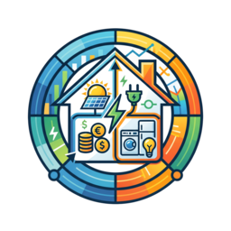

# Energy Profiler

[](https://github.com/hacs/integration)
[](https://github.com/nicola-spreafico/home-assistant-energy-profiler/actions/workflows/validate.yml)
[](https://github.com/nicola-spreafico/home-assistant-energy-profiler/releases)
[](LICENSE)
[](https://github.com/nicola-spreafico/home-assistant-energy-profiler/commits)
[](https://github.com/nicola-spreafico/home-assistant-energy-profiler/issues)
[](https://buymeacoffee.com/mf3ebnouct)

<p align="center">
  
</p>

**Per-device energy intelligence for Home Assistant: energy, cost, solar self-sufficiency, appliance run cycles, standby waste and house prosumption scoring — from just two sensors per device, configured entirely in YAML.**

## Why this integration exists

**This integration draws nothing.** No cards, no themes, no views — it produces numbers, and only numbers, each one an entity you are free to chart, automate on, or never look at.

That is a deliberate order of priorities, and it rests on one asymmetry: **presentation is reversible and measurement is not.** A card can be restyled tomorrow, next year, or the day you finally have an opinion about it. A quantity you never computed is simply gone — you cannot go back and measure yesterday. So the work goes into getting the data right and recorded first, on the assumption that the questions worth asking of it are not all obvious yet. Some of them are below.

> *"Your energy dashboard says the house is 70% self-sufficient. Good — but if
> you want to **improve** that number, which device do you act on? Maybe the
> dishwasher already runs at 95% and there is nothing left to optimize, while
> the washing machine sits at 20% — that is where the effort pays off, for
> example by washing when the sun is shining."*

> *"Did yesterday's washing-machine cycle actually run on the clean energy of
> the sun, or did it silently pull half of its load from the grid — and what
> did it cost you?"*

> *"How much money does the TV burn per year just sitting in standby, and is
> the bedroom A/C running longer per cycle than it used to?"*

> *"In February you were only 30% self-sufficient, and it looks like a bad
> month. But the panels made 6 kWh a day against the 20 you used — so was it a
> bad month, or was 30% everything February could physically give you? And of
> the sun you did get, did any of it go to waste, and which appliance was
> actually catching it?"*

Energy Profiler was created for these questions. House-level graphs tell you
*what* your self-sufficiency is, but not *where* to act to improve it — that
takes the same solar/grid/cost breakdown **per device**. The native **Energy
Dashboard** is great at the *house* level — total consumption, solar
production, grid import/export — and its individual-devices view stops at a
bar of kWh per device. Everything behind that number is missing, and that is
exactly what this integration provides:

| | Native Energy Dashboard | Energy Profiler |
| --- | --- | --- |
| **Per-device consumption** | total kWh only | energy split into **total / running / standby**, each with per-period meters |
| **Per-device solar share** | house-level only | solar-vs-grid (and optionally solar-vs-battery) split **per device**, as live power, energy and % |
| **Per-device cost** | house-level cost only | € per device at the tariff valid *at the moment of consumption*, plus savings and grid-import cost |
| **Appliance runs** | not tracked | cycles detected and validated, with per-run energy/cost/duration, means, lifetime totals |
| **Standby waste** | invisible | measured continuously, with the same cost/solar breakdown as useful consumption |
| **Automations** | none | events on completed/validated cycles and a ready-made `running`/`standby`/`poweroff` status |
| **Production vs consumption** | how much you produced, used and exported | the same, plus **self-consumption** and **prosumption** per period — how much of the *achievable* coupling you achieved once the size of the roof is divided out — and a per-device leaderboard built on it |

## What you get

Point it at a device's power and energy sensors and it builds the whole analytical stack for you:

- **Energy in three symmetric groups** — **total**, **running-only** and **standby-only**: each group exposes the same block (energy, solar/grid split, cost, savings/grid-cost, self-sufficiency %, per-period meters), so separating useful consumption from "vampire" waste never costs you the solar or cost breakdown
- **Cost** — € accumulated at the price valid *at the moment of consumption*, projected cost rates (€/h, €/day, …)
- **Self-sufficiency** — how much of each group's energy came from your own production vs the grid, what it saved you and what the grid imports cost, as instantaneous power, cumulative energy and percentages; declare a battery flow and the self share splits again into **direct solar vs battery discharge** (`from_solar` / `from_battery`) — e.g. how much sun, how much battery and how much grid a washing-machine run actually used. All of it derived from the house flows in watts: you are never asked to supply a percentage
- **Run cycles** — detects appliance runs (dishwasher, washing machine, A/C…), validates them against duration/energy limits, and tracks per-run values, means and totals; fires events you can automate on
- **Device status label** — a ready-made `running`/`standby`/`poweroff` enum for dashboards
- **Prosumption** — the house scored against what was *achievable*, not against 100%. Self-sufficiency is capped by your production and self-consumption by your consumption, so in every period one of the two is being dragged down by plenty on its own side rather than by anything you did; **prosumption** divides by whichever side was actually scarce, leaving only how well the two met **in time**. Its complement is the only genuine waste — energy that existed and demand that existed, which missed each other by a few hours. And because it gives every period a *baseline*, it turns the per-device percentages into a leaderboard that is fair to appliances which cannot be rescheduled: a fridge lands neutrally at 1.00×, not at the bottom

### The entity count is not the number that matters

A fully-equipped device exposes over two hundred entities, and that alarms people. It should not, because the quantity worth worrying about is **rows in your database**, and the two are barely related.

All cumulative series are backed by [Lean Utility Meter](https://github.com/nicola-spreafico/home-assistant-lean-utility-meter). A period meter writes **one consolidated long-term row per closed period** instead of one per hour, and it is kept out of the recorder entirely, so it writes **no state rows at all** — while the dashboards stay live.

The arithmetic, from a real fully-equipped device with `[daily, monthly, yearly]`:

| | Long-term rows / year | State rows / year |
| --- | ---: | ---: |
| **90 period meters** — an entire device | ~11,300 | **0** |
| **One ordinary utility meter**, recorded | 8,760 | 100,000+ |

One conventional meter costs an hourly row forever — 8,760 a year — plus a state row every time its source moves, which on a power-derived sensor is six figures annually. All ninety of a device's meters together cost about **1.3 of those**, and none of the state rows.

So the honest way to read the entity count is: it is the number of *questions you can ask*, not the number of things being written down. That only holds if the recorder is configured as documented in [Recorder Setup](docs/recorder.md) — which is why that page says to read it first.

## Requirements

Hard dependency on [lean_utility_meter](https://github.com/nicola-spreafico/home-assistant-lean-utility-meter)
**version 1.2.0 or later**: cumulative/cycle sensors reuse its Lean core, and this
integration builds them through the public API introduced in that release. Install
it first — without it, this integration will refuse to set up. Home Assistant has
no way to enforce a version constraint between custom integrations, so an older
Lean fails at import time with an `ImportError` in the log rather than a clear
message.

## Quick Start

### Only have a power sensor?

`energy:` is **required** per device — this integration does not derive it for you, since Home Assistant already ships a native way to do that. If your device only reports instantaneous power (no cumulative energy), add a core [Integration - Riemann sum integral](https://www.home-assistant.io/integrations/integration/) sensor to turn that power reading into energy first, then point `energy:` at the resulting sensor.

### Your first device

A `devices:` list, merged across package files. Two sensors are all it takes to start:

```yaml
energy_profiler:
  devices:
    - name: dishwasher
      power: sensor.dishwasher_power
      energy: sensor.dishwasher_energy
```

The configuration stays in YAML, but the result is visible under *Settings → Devices & Services*: one device per appliance, plus a system device carrying the live house shares and the derived solar contribution. See [The UI surface](docs/ui.md).

Then configure the recorder — this part is **not optional**: the period meters write their own long-term statistics, and letting the recorder record them too corrupts the series with duplicate rows. [Recorder Setup](docs/recorder.md) tells you exactly what to include or exclude depending on how your system is set up.

## The levels

A fully-equipped device exposes **219 entities** — which is a lot to meet all at once. So don't: the integration is built as a ladder, and every rung is useful on its own. Each level asks one question about what you already have, and answers with a specific set of sensors. (And the number is not a database problem — see [The entity count is not the number that matters](#the-entity-count-is-not-the-number-that-matters).)

| Level | You have… | You get | New | Total |
| --- | --- | --- | --- | --- |
| **[1 — Energy](docs/levels/01-energy.md)** | a power and an energy sensor | consumption per period, on a database diet | 5 | 5 |
| **[2 — Cost](docs/levels/02-cost.md)** | …and an electricity price | € at the tariff of the moment, plus live projections | 7 | 12 |
| **[3 — Self-sufficiency](docs/levels/03-self-sufficiency.md)** | …and the house grid/load flows | solar-vs-grid split per device, savings and grid cost | 29 | 41 |
| **[4 — Solar vs battery](docs/levels/04-solar-battery.md)** | …and the battery discharge flow | how much was sunshine, how much was the battery | 18 | 59 |
| **[5 — Running](docs/levels/05-running.md)** | a way to tell "on" from "off" | the whole block again, over running time only | 50 | 109 |
| **[6 — Standby](docs/levels/06-standby.md)** | a way to spot idle draw | the whole block again, over vampire waste | 50 | 159 |
| **[7 — Cycles](docs/levels/07-cycles.md)** | appliances that run in cycles | per-run energy, cost and solar share, with events | 54 | 213 |
| **[8 — Prosumption](docs/levels/08-prosumption.md)** | the house energy counters | how well production and consumption met, and a fair per-device leaderboard | 6 (+29 house) | 219 |

Counts assume the default `periods: [daily, monthly, yearly]` and every optional source configured; fewer options mean fewer entities. Level 8 is the only one whose count is mostly *house* entities rather than per-device ones — see below.

**Levels 1–4 ask what you can measure.** Each optional source adds a sub-block: a price brings cost, the house grid and load flows bring the solar/grid split, a battery flow splits that again into panels versus battery. They also compose — a price *and* the flows together unlock savings and grid cost, which neither gives alone.

**Levels 5–7 ask which slice you measure it over.** They add no new kind of sensor: they replicate the block you already built over a gated slice of the consumption. Teach the integration to tell running from idle and you get the same energy, cost and solar breakdown for running time and for standby waste, separately. That multiplication is exactly why the total reaches 213 — and why it is far less to learn than the number suggests.

**Level 8 turns the question around.** Levels 1–7 all look at where an appliance's energy came *from*. Level 8 looks at what happened to the energy you *produced* — a question that only exists at house level, since no appliance has a production of its own. It reads energy counters rather than the instantaneous flows, so it stands alone: you can have it without any of the others. What it gives back to the devices is a **baseline**, and with it the one thing per-device percentages cannot deliver on their own — a leaderboard that is fair to appliances which cannot be rescheduled.

Stop at any rung. Level 1 alone is a complete, useful setup.

### The house power flows

Levels 3 and 4 need the flows of your house, in watts — the readings your inverter or energy meter already publishes. You are never asked for a percentage: the shares are computed from these, per tick, and the percentages come back out as sensors.

Declare `grid` plus either `load` (the solar contribution is then derived as the remainder) or an explicit `solar`, and add `battery` if you store energy. What you declare decides what gets built: no battery flow, no battery entities.

```yaml
power_flows:
  load: sensor.house_load_power             # total house consumption
  grid: sensor.grid_import_power            # the part covered by the grid
  battery: sensor.battery_discharge_power   # optional: enables level 4
  # solar: — not declared here. It is derived as load − grid − battery, because
  # solar-to-load is the one reading inverters rarely expose (what they publish
  # is production, which also feeds the battery and the export). Declare it
  # explicitly only if you really have it, and then drop `load:` — the two are
  # mutually exclusive.
```

Each flow is a **contribution to the load**, not a production figure — `solar` means solar-to-load, never raw panel output. [Level 3](docs/levels/03-self-sufficiency.md#what-the-flows-must-mean) explains why the distinction silently skews the split if you get it wrong.

### The house energy counters

[Level 8](docs/levels/08-prosumption.md) needs a different kind of input: **kWh totals**, not watts, and including the two readings `power_flows` deliberately excludes — raw production and export.

```yaml
energy_flows:
  consumption: sensor.house_consumption_energy_total   # required
  import:      sensor.grid_import_energy_total         # required
  production:  sensor.pv_production_energy_total       # optional: unlocks prosumption
  export:      sensor.grid_export_energy_total         # optional: the cross-check
```

They are a separate block rather than more keys inside `power_flows` because they mean something else. Every `power_flows` key is a contribution to the house load and they sum to it; production and export are not, and folding them in would dissolve an invariant the schema actively defends. `energy_flows:` also has no per-device form — it describes the whole house, and a device overriding it would be claiming a second one.

### Shared defaults — once for the whole system

The flows and the price are almost always the same for every device, so declare them once. `defaults:` goes in **exactly one** place: it is the system-wide baseline every device inherits. Any key can then be overridden by a single device, or opted out with `null`. Thanks to Home Assistant's package merge, this block can live in its own file while the devices are spread across other packages.

```yaml
energy_profiler:
  defaults:
    energy_price: sensor.energy_price_purchase   # level 2: the cost sub-block
    power_flows:                                 # levels 3-4: the split
      load: sensor.house_load_power
      grid: sensor.grid_import_power
      battery: sensor.battery_discharge_power
    energy_flows:                                # level 8: prosumption + leaderboard
      consumption: sensor.house_consumption_energy_total
      import: sensor.grid_import_energy_total
      production: sensor.pv_production_energy_total
    name_suffix: _em                   # entity prefix = <name> + this suffix
    live_update_interval: "00:15:00"   # throttle for the meters' live LTS upserts
    periods: [daily, monthly, yearly]  # meter windows: hourly..yearly
```

```yaml
energy_profiler:
  devices:
    - name: home_office
      power: sensor.home_office_power
      energy: sensor.home_office_energy
      power_flows: null                # this device only: no split (drops levels 3-4)
      periods: [daily, monthly]        # fewer meter windows than the default
```

`power_flows:` is replaced wholesale by a device, never merged key by key — a half-inherited block would mix two houses' readings.

## Documentation

| Page | What you'll find |
| --- | --- |
| [Recorder Setup](docs/recorder.md) | **Read this first.** What to exclude/include and why, with ready-made blocks for both exclude-based and include-based (whitelist) systems |
| [The levels](#the-levels) | The guided path: [1 Energy](docs/levels/01-energy.md) → [2 Cost](docs/levels/02-cost.md) → [3 Self-sufficiency](docs/levels/03-self-sufficiency.md) → [4 Solar vs battery](docs/levels/04-solar-battery.md) → [5 Running](docs/levels/05-running.md) → [6 Standby](docs/levels/06-standby.md) → [7 Cycles](docs/levels/07-cycles.md) → [8 Prosumption](docs/levels/08-prosumption.md). Each page: minimum config and the exact sensors it unlocks |
| [Entity reference](docs/entities.md) | Flat lookup: you see an entity, you want to know what it is, what unlocked it and how to record it |
| [Configuration](docs/configuration.md) | Every option, grouped by area: base, shared defaults, running detection, cycle analytics, standby |
| [Services & Actions](docs/services.md) | `reset` and the entities it supports; which entities are Lean-native meters and answer to Lean's own services |
| [The UI surface](docs/ui.md) | The device pages: one per appliance plus a system device with the live house shares, the derived solar contribution, and the declared configuration |

### Examples

Focused configurations in the `examples/` directory:

| File | Shows |
|------|-------|
| `basic_consumption.yaml` | minimal per-device energy + cost |
| `self_sufficiency.yaml`  | solar/grid split + savings/grid-cost |
| `prosumption.yaml`       | house energy counters + the per-device leaderboard |
| `cycle_counting.yaml`    | run detection (power threshold / template) |
| `standby.yaml`           | idle "vampire" consumption |
| `full.yaml`              | shared defaults + a mixed fleet |

## Services

- `energy_profiler.reset` — zero a resettable entity (lifetime accumulators, cycle counters, peak power); no-op on entities with nothing to reset
- The per-period meters are **native Lean entities**, so Lean's own services (`lean_utility_meter.thin_history`, `import_history`, `clear_history`, `calibrate`) target them directly

Details and the full entity lists in [Services & Actions](docs/services.md).

The cycles family also fires `energy_profiler_cycle_completed` / `_cycle_discarded` events for your own automations — payload documented in [Level 7 — Cycles](docs/levels/07-cycles.md#events).

## Status

🚧 Pilot phase. All families are implemented (**power**, **energy**, **cost**, **self-sufficiency**, **cycles**, **standby**, **prosumption**) and running in parallel with the legacy generator on a pilot device.

**Fixed in 2.1.0:** the `…_from_self_percentage_<period>` meters mirrored the *lifetime* ratio instead of the period's own, so a daily figure barely moved from one day to the next and could not distinguish a device that ran at noon from one that ran at 3am. They now divide that period's two meters. Entity ids and statistics metadata are unchanged, so no migration is needed — but the long-term values recorded **before** this version are the old (lifetime) quantity, and the two are not comparable across the upgrade boundary.

Successor to the `scripts/energy_monitor` code generator: instead of rendering
~66 static YAML packages, it creates the same entities dynamically from an
`energy_profiler:` config block, preserving the historical entity ids.
